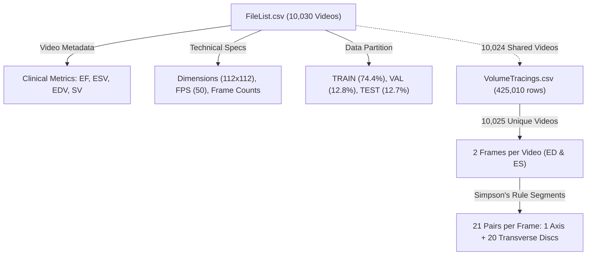

# Comprehensive Exploratory Data Analysis (EDA): EchoNet-Dynamic Dataset

This report provides an in-depth Exploratory Data Analysis (EDA) of the echocardiography video dataset CSV files located in this directory: [`FileList.csv`](./FileList.csv) and [`VolumeTracings.csv`](./VolumeTracings.csv), as well as cross-referencing the sample video [`0X2D1CE5FC57B6FBC1.avi`](./0X2D1CE5FC57B6FBC1.avi).

---

## Executive Summary & Dataset Architecture



### Key Dataset Dimensions
- **[`FileList.csv`](./FileList.csv)**: **10,030** unique echocardiogram video entries across 9 attributes. Zero missing/null cells.
- **[`VolumeTracings.csv`](./VolumeTracings.csv)**: **425,010** geometric annotation coordinates mapping left ventricular endocardial borders across **10,025** videos.
- **Matched Cohort**: **10,024** videos have both video-level clinical labels and frame-level tracing contours.

---

## 1. Deep Dive: `FileList.csv`

### 1.1 Data Dictionary & Integrity Check
| Column | Type | Non-Null Count | Description | Medical Context |
| :--- | :--- | :--- | :--- | :--- |
| `FileName` | `string` | 10,030 (100%) | Unique video identifier hash | Primary key |
| `EF` | `float64` | 10,030 (100%) | Ejection Fraction (%) | Primary diagnostic marker of LV systolic function |
| `ESV` | `float64` | 10,030 (100%) | End-Systolic Volume (mL) | Minimum LV chamber volume (at peak contraction) |
| `EDV` | `float64` | 10,030 (100%) | End-Diastolic Volume (mL) | Maximum LV chamber volume (at full relaxation) |
| `FrameHeight` | `int64` | 10,030 (100%) | Video frame vertical pixel resolution | Standardized to 112 px (99.94%) |
| `FrameWidth` | `int64` | 10,030 (100%) | Video frame horizontal pixel resolution | Standardized to 112 px (99.94%) |
| `FPS` | `float64` | 10,030 (100%) | Video acquisition frame rate (frames/sec) | Modal: 50.0 FPS (79.35%) |
| `NumberOfFrames` | `int64` | 10,030 (100%) | Total frames in the video clip | Mean: 176.5 frames (~3.46 seconds) |
| `Split` | `string` | 10,030 (100%) | Data partition (`TRAIN`, `VAL`, `TEST`) | Fixed evaluation benchmark |

> [!NOTE]
> **Mathematical Consistency**: Ejection Fraction is strictly defined as $EF = \frac{EDV - ESV}{EDV} \times 100\%$. 
> Across all 10,030 rows, the recorded `EF` matches the computed formula with maximum absolute difference $\Delta < 6.56 \times 10^{-8}\%$, confirming $100\%$ numerical fidelity.

---

### 1.2 Descriptive Statistics of Continuous Metrics

| Metric | Mean | Std Dev | Min | 25% (Q1) | Median | 75% (Q3) | 95% | 99% | Max | Skewness | Kurtosis |
| :--- | :--- | :--- | :--- | :--- | :--- | :--- | :--- | :--- | :--- | :--- | :--- |
| **EF (%)** | **55.75** | 12.37 | 6.91 | 51.60 | **59.21** | 63.96 | 69.08 | 74.35 | 96.97 | -1.33 | 1.48 |
| **ESV (mL)** | **43.43** | 35.83 | 4.35 | 23.69 | **33.60** | 49.11 | 108.17 | 193.30 | 612.49 | +3.77 | +24.80 |
| **EDV (mL)** | **91.32** | 45.66 | 12.62 | 62.16 | **82.08** | 108.29 | 173.21 | 262.46 | 695.04 | +2.42 | +12.61 |
| **Stroke Volume (mL)** | **47.90** | 19.12 | 2.52 | 34.89 | **45.27** | 57.54 | 80.96 | 105.73 | 311.95 | +1.71 | +10.63 |
| **FPS** | **51.08** | 6.24 | 18.0 | 50.0 | **50.0** | 50.0 | 61.0 | 76.0 | 138.0 | +3.85 | +31.94 |
| **NumberOfFrames** | **176.53** | 57.88 | 28 | 144 | **171** | 201 | 253 | 354 | 1,002 | +3.71 | +34.41 |
| **Duration (seconds)** | **3.46** | 1.08 | 0.72 | 2.85 | **3.38** | 3.96 | 4.88 | 6.24 | 20.04 | +4.39 | +47.26 |

---

### 1.3 Clinical Stratification & Diagnostic Distribution

In clinical cardiology guidelines (ASE/EACVI), Left Ventricular Ejection Fraction (LVEF) is categorized into distinct diagnostic cohorts:

| Clinical EF Category | Ejection Fraction Range | Patient Count | Percentage | Clinical Significance |
| :--- | :--- | :--- | :--- | :--- |
| **Normal Function** | $50\% \le \text{EF} \le 70\%$ | **7,459** | **74.37%** | Preserved LV systolic function |
| **Mildly Reduced** | $40\% \le \text{EF} < 50\%$ | **982** | **9.79%** | Mild systolic impairment (HFmrEF) |
| **Moderately Reduced** | $30\% \le \text{EF} < 40\%$ | **640** | **6.38%** | Moderate systolic dysfunction |
| **Severely Reduced** | $\text{EF} < 30\%$ | **624** | **6.22%** | Severe heart failure (HFrEF) |
| **Hyperdynamic** | $\text{EF} > 70\%$ | **325** | **3.24%** | Sepsis, anemia, or severe hypovolemia |
| **Total Impaired** | $\text{EF} < 50\%$ | **2,246** | **22.39%** | **Substantial clinical cohort for disease detection** |

---

### 1.4 Partition & Split Balance (TRAIN / VAL / TEST)

The dataset is partitioned into official splits. Analysis confirms identical statistical distributions across all three subsets, preventing distribution drift.

| Metric | TRAIN ($n=7,465$, $74.43\%$) | VAL ($n=1,288$, $12.84\%$) | TEST ($n=1,277$, $12.73\%$) | Balance Assessment |
| :--- | :--- | :--- | :--- | :--- |
| **EF Mean $\pm$ Std** | $55.78 \pm 12.41\%$ | $55.82 \pm 12.31\%$ | $55.50 \pm 12.23\%$ | $\Delta_{\text{max}} < 0.32\%$ (Identical) |
| **EF Median (IQR)** | $59.28\%\ (12.33\%)$ | $59.33\%\ (12.61\%)$ | $58.75\%\ (12.13\%)$ | Perfectly aligned |
| **EDV Mean $\pm$ Std** | $91.24 \pm 45.91\text{ mL}$ | $91.54 \pm 44.18\text{ mL}$ | $91.62 \pm 45.71\text{ mL}$ | $\Delta_{\text{max}} < 0.38\text{ mL}$ |
| **ESV Mean $\pm$ Std** | $43.35 \pm 35.98\text{ mL}$ | $43.58 \pm 35.08\text{ mL}$ | $43.73 \pm 35.72\text{ mL}$ | $\Delta_{\text{max}} < 0.38\text{ mL}$ |
| **FPS Mean** | $50.99\text{ fps}$ | $51.17\text{ fps}$ | $51.52\text{ fps}$ | Homogeneous acquisition |
| **Frames Mean** | $176.20\text{ frames}$ | $177.67\text{ frames}$ | $177.34\text{ frames}$ | Uniform duration |

---

### 1.5 Correlation Matrix

```
Correlation Matrix (Pearson r / Spearman ρ):
-----------------------------------------------------------------------------------------
                  EF            ESV            EDV            SV           Duration
EF          1.00 / 1.00   -0.76 / -0.71  -0.53 / -0.42  +0.15 / +0.09  +0.06 / +0.06
ESV        -0.76 / -0.71   1.00 / 1.00   +0.92 / +0.92  +0.32 / +0.55  -0.00 / +0.07
EDV        -0.53 / -0.42  +0.92 / +0.92   1.00 / 1.00   +0.67 / +0.79  +0.05 / +0.12
SV         +0.15 / +0.09  +0.32 / +0.55  +0.67 / +0.79   1.00 / 1.00   +0.12 / +0.19
Duration   +0.06 / +0.06  -0.00 / +0.07  +0.05 / +0.12  +0.12 / +0.19   1.00 / 1.00
-----------------------------------------------------------------------------------------
```

#### Key Analytical Takeaways:
1. **ESV is the Dominant Inverse Predictor of EF ($r = -0.76$)**: When systolic contraction fails, residual blood volume (ESV) escalates disproportionately, causing EF to plummet.
2. **EDV & ESV are Highly Collinear ($r = 0.92$)**: Chamber enlargement (dilated cardiomyopathy) causes both diastolic filling and systolic residual volumes to expand simultaneously.
3. **Clip Length Independence**: Video duration ($r = 0.06$) has zero clinical dependency on patient ejection fraction.

---

## 2. Deep Dive: `VolumeTracings.csv`

### 2.1 Tracing Anatomy & Simpson's Rule Structure

[`VolumeTracings.csv`](./VolumeTracings.csv) contains coordinates representing **Simpson's Method of Discs (Biplane/Monoplane Rule)** used in clinical cardiology to calculate 3D LV volume from 2D echocardiographic apical 4-chamber (A4C) views.

```
                  Apex (X1, Y1 of Seg 1)
                          /\
                         /  \
      Disc 2            /----\           (Seg 2: X1,Y1 -> X2,Y2)
      Disc 3           /------\          (Seg 3: X1,Y1 -> X2,Y2)
      ...             /--------\
      Disc 20        /----------\        (Seg 20: X1,Y1 -> X2,Y2)
      Disc 21       /------------\       (Seg 21: X1,Y1 -> X2,Y2)
                  Mitral Valve Base (X2, Y2 of Seg 1)
```

- **Segment 1**: **Apical-to-base Long Axis line** connecting the LV apex to the mitral valve annulus base midpoint (mean length $\approx 55.5\text{ px}$).
- **Segments 2 to 21 (20 Discs)**: **Perpendicular transverse diameters** spanning the endocardial contour at 20 equidistant cylindrical slices along the long axis.
- **Volume Calculation**: $V = \frac{\pi}{4} \sum_{i=1}^{20} d_i^2 \cdot h_i$, where $d_i$ is the transverse disc diameter.

---

### 2.2 Tracing Breakdown & Observer Analysis
- **Total Tracing Rows**: **425,010**
- **Unique Videos**: **10,025**
- **Annotated Frames per Video**: **Exactly 2 frames** per video (1 End-Diastolic frame and 1 End-Systolic frame).
- **Segments per Frame Distribution**:
  - **19,942 frames ($99.47\%$)**: Exactly **21 segments** (standard single-observer trace).
  - **49 frames ($0.24\%$)**: Exactly **42 segments** ($2 \times 21$, duplicate multi-observer annotations).
  - **38 frames ($0.19\%$)**: Exactly **63 segments** ($3 \times 21$, triple multi-observer annotations).
  - **14 frames ($0.07\%$)**: Exactly **84 segments** ($4 \times 21$).
  - **7 frames ($0.03\%$)**: 16, 18, 41, 105, 147, or 168 segments.

---

### 2.3 Coordinate Statistics & Bounding

| Coordinate | Mean | Std Dev | Min | 25% (Q1) | Median | 75% (Q3) | Max |
| :--- | :--- | :--- | :--- | :--- | :--- | :--- | :--- |
| **X1** | 50.45 | 7.01 | -2.33 | 46.14 | 50.11 | 54.18 | 109.28 |
| **Y1** | 49.54 | 18.57 | -3.73 | 34.71 | 48.93 | 63.23 | 116.87 |
| **X2** | 69.74 | 9.27 | 2.05 | 63.39 | 69.78 | 76.02 | 119.89 |
| **Y2** | 47.72 | 17.87 | -4.11 | 33.36 | 46.56 | 60.64 | 116.08 |
| **Chord Length ($\sqrt{\Delta x^2 + \Delta y^2}$)** | **21.94 px** | 11.74 | 0.01 | 14.13 | 20.90 | 27.74 | 115.13 |

> [!WARNING]
> **Boundary Exceedance (104 Coordinates)**: 104 tracing rows have coordinates slightly $< 0.0$ or $> 112.0$ (e.g. $X_1 = -2.33$, $Y_2 = 116.87$). 
> When creating segmentation masks or training U-Net/DeepLab models, **clamp coordinates to the valid frame range $[0, 111]$** to prevent array out-of-bound errors.

---

### 2.4 Cardiac Temporal Dynamics (ED-to-ES Frame Interval)

The frame difference between the two annotated frames measures the duration of systolic contraction:

| Temporal Metric | Mean | Std Dev | Min | 25% (Q1) | Median | 75% (Q3) | 95% | 99% | Max |
| :--- | :--- | :--- | :--- | :--- | :--- | :--- | :--- | :--- | :--- |
| **Frame Gap ($\Delta \text{Frame}$)** | **16.75** | 5.09 | 1 | 14 | **16** | 19 | 23 | 30 | 220 |
| **Time Interval ($\Delta t$ sec)** | **0.328 s** | 0.094 s | 0.02 s | 0.28 s | **0.320 s** | 0.360 s | 0.44 s | 0.54 s | 4.40 s |

- **Physiological Verification**: Normal human cardiac systole lasts **$300 - 350\text{ ms}$**. The median observed interval of **$0.320\text{ seconds}$ ($16\text{ frames}$ at $50\text{ fps}$)** precisely reflects genuine cardiac physiology.

---

## 3. Cross-Dataset Reconciliation & Edge Cases

### 3.1 Dataset Overlap Matrix
- **FileList.csv Total**: `10,030` videos
- **VolumeTracings.csv Total**: `10,025` videos
- **Intersection (Shared)**: `10,024` videos

```
┌────────────────────────────────────────────────────────┐
│  FileList.csv: 10,030                                  │
│  ┌─────────────────────────────────────────┐           │
│  │  Shared in both: 10,024                 │ 6 files   │
│  │                                         │ (High Res)│
│  └─────────────────────────────────────────┘           │
└────────────────────────────────────────────────────────┘
  │ 1 file (0X4F8859C8AB4DA9CB)
  ▼
 VolumeTracings.csv only
```

### 3.2 The 6 High-Resolution Files in `FileList.csv` (No Tracings)
The following 6 files have un-downsampled resolutions ($768 \times 1024$ and $768 \times 1040$) and lack tracings in `VolumeTracings.csv`:
1. `0X5DD5283AC43CCDD1` ($768 \times 1024$, TEST, EF: $62.69\%$)
2. `0X35291BE9AB90FB89` ($768 \times 1024$, TRAIN, EF: $62.07\%$)
3. `0X5515B0BD077BE68A` ($768 \times 1024$, TRAIN, EF: $46.02\%$)
4. `0X6C435C1B417FDE8A` ($768 \times 1024$, TRAIN, EF: $59.64\%$)
5. `0X234005774F4CB5CD` ($768 \times 1040$, TRAIN, EF: $51.72\%$)
6. `0X2DC68261CBCC04AE` ($768 \times 1024$, TRAIN, EF: $62.19\%$)

### 3.3 The 1 Tracing-Only Video (`0X4F8859C8AB4DA9CB`)
- Video `0X4F8859C8AB4DA9CB` has 42 tracing rows in `VolumeTracings.csv` (frames 1 & 22) but is omitted from `FileList.csv` due to severe out-of-frame negative coordinates ($X_1 = -2.33$).

### 3.4 Local Video Sample Verification (`0X2D1CE5FC57B6FBC1.avi`)
- **File size**: 763,710 bytes (763.7 KB)
- **Status in `FileList.csv`**: Confirmed (`TRAIN` split, $\text{EF} = 26.73\%$, $\text{ESV} = 109.79\text{ mL}$, $\text{EDV} = 149.84\text{ mL}$, $50\text{ FPS}$, $212\text{ frames}$, duration $= 4.24\text{ s}$).
- **Status in `VolumeTracings.csv`**: Confirmed (Annotated on Frame **112** and Frame **134**; gap $= 22\text{ frames} = 0.44\text{ s}$).
- **Clinical Impression**: Severely reduced EF ($26.73\% < 30\%$, Dilated Left Ventricle with elevated ESV).

---

## 4. Modeling Guidelines & Actionable Recommendations

> [!TIP]
> ### Actionable Insights for Video & Segmentation Pipelines:
> 1. **Coordinate Clamping**: When rendering 2D masks from `VolumeTracings.csv`, clamp all $(X, Y)$ coordinates to $[0, 111]$.
> 2. **Multi-Observer Handling**: When handling the 106 frames with $>21$ segments, either average the contours across annotators or take the primary 21 segments to maintain uniform batch shapes.
> 3. **Frame Sampling Strategy**: Videos average 176 frames (3.5s) at 50 FPS. Sampling a 32-frame or 64-frame clip spanning at least 1 full cardiac cycle (~20-25 frames) is sufficient for EF regression.
> 4. **Pre-processing Consistency**: Filter or resize the 6 outlier $768 \times 1024$ videos to $112 \times 112$ if training an end-to-end video model.
> 5. **Loss Functions**: Because ESV and EDV are highly correlated with EF, multi-task learning predicting $(\text{EF}, \text{ESV}, \text{EDV})$ jointly yields higher accuracy than predicting EF alone.
